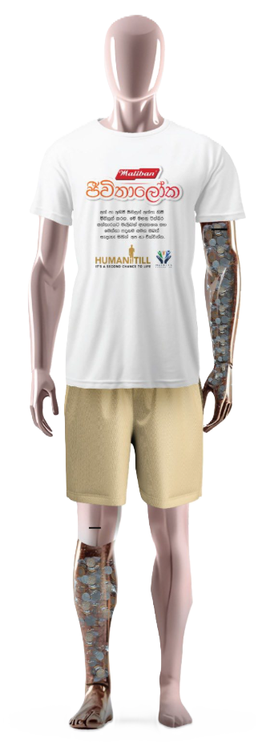

# HumaniTill - Restoring Hope



## 🌟 About

HumaniTill is an innovative Corporate Social Responsibility (CSR) initiative by **Maliban Biscuit Manufactories** as part of the Jeewithaloka program. This project features a life-sized, human-shaped transparent donation box that serves as a powerful symbol of missing limbs and the hope for restoration.

### Mission
To provide free prosthetic limbs to individuals in need across Sri Lanka, restoring their mobility, independence, and dignity.

## 🎯 Project Overview

- **Initiative**: CSR project under Maliban's Jeewithaloka program
- **Partner**: Meththa Foundation
- **Launch Location**: Jaya Sri Maha Bodhi and Ruwanwelisaya, Anuradhapura
- **Launch Date**: During the sacred Poson Poya
- **Target**: Individuals who have lost limbs due to accidents, illness, or conflict

## 🤝 How It Works

1. **Symbolic Collection**: The transparent, human-shaped donation box represents missing limbs and collects public donations
2. **Partnership**: Funds are channeled through our partnership with the Meththa Foundation
3. **Direct Impact**: Donations directly provide high-quality prosthetic limbs to beneficiaries
4. **Free Service**: All prosthetic limbs are provided completely free of charge

## 🌐 Website Features

This website showcases the HumaniTill initiative with:

- **Responsive Design**: Optimized for desktop, tablet, and mobile devices
- **Interactive Navigation**: Smooth scrolling and hamburger menu for mobile
- **Project Gallery**: Visual documentation of the initiative
- **Impact Stories**: Testimonials and success stories
- **Contact Information**: Ways to get involved or learn more

## 🛠️ Technologies Used

- **HTML5**: Semantic markup and structure
- **CSS3**: Modern styling with flexbox and grid layouts
- **JavaScript**: Interactive features and smooth scrolling
- **Google Fonts**: Inter font family for clean typography
- **Responsive Design**: Mobile-first approach

## 📁 Project Structure

```
human_till/
├── index.html          # Main website file
├── style.css          # Stylesheet
├── script.js          # JavaScript functionality
├── temp.html          # Additional HTML file
├── images/            # Image assets
│   ├── main-logo.png
│   ├── main-image.png
│   ├── maliban-logo.png
│   ├── humanitill-official.jpg
│   ├── helping-hands.jpg
│   ├── temple-sri-lanka.jpg
│   └── ...
└── README.md          # Project documentation
```

## 🚀 Getting Started

1. **Clone the repository**:
   ```bash
   git clone https://github.com/MG4ACA/humantill_portfolio-.git
   ```

2. **Navigate to the project directory**:
   ```bash
   cd humantill_portfolio-
   ```

3. **Open in browser**:
   - Simply open `index.html` in your web browser
   - Or use a local server for development

## 💡 Key Features

- **Modern UI/UX**: Clean, professional design that reflects the humanitarian mission
- **Mobile Responsive**: Fully optimized for all device sizes
- **Interactive Elements**: Smooth animations and user-friendly navigation
- **Accessibility**: Semantic HTML and proper alt text for images
- **SEO Optimized**: Meta tags and structured content for search engines

## 🌟 Impact

> "At Maliban, inspiring goodness is a way of life. With the HumaniTill, we aim to give people not only mobility, but a second chance at life."
> 
> — Positha Perera, Group Head of Corporate Communications, Maliban Group of Companies

## 🤝 Partnership

**Meththa Foundation**: Our trusted partner in identifying beneficiaries and ensuring proper distribution of prosthetic limbs to those most in need.

## 📧 Contact

For more information about the HumaniTill initiative or to get involved:

- **Website**: [Visit the live site](https://mg4aca.github.io/humantill_portfolio-/)
- **Organization**: Maliban Biscuit Manufactories
- **Program**: Jeewithaloka CSR Initiative

## 📄 License

This project is created for humanitarian purposes as part of Maliban's Corporate Social Responsibility initiatives.

---

**Together, we restore hope and rebuild lives, one step at a time.**


